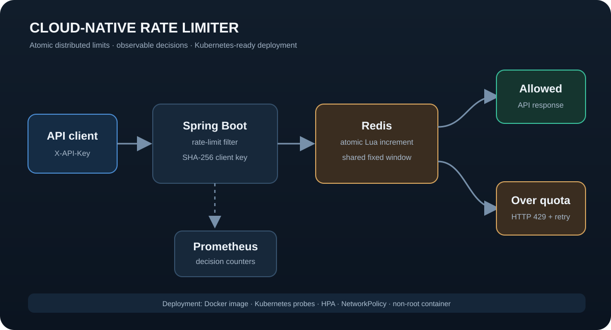

# Cloud-Native Rate Limiter

[](https://github.com/Samrith-026/cloud-native-rate-limiter/actions/workflows/ci.yml)

[Live portfolio](https://durgasamrithuppala.netlify.app/) · Built by [Durga Samrith Uppala](https://github.com/Samrith-026)

A production-minded Spring Boot service that protects `/api/**` with an atomic Redis fixed-window limit. It returns rate-limit headers, exposes Prometheus metrics, emits structured JSON logs, and includes a hardened Kubernetes deployment plus an incident runbook.

## Architecture



Redis executes the increment and expiry as one Lua operation, so multiple service replicas share the same counters without a check-then-write race. Client identifiers are stored and logged as SHA-256 fingerprints rather than raw API keys or IP addresses.

## What this demonstrates

- Atomic distributed rate limiting across horizontally scaled instances.
- `200`, `429`, and fail-closed `503` behavior.
- `RateLimit-Limit`, `RateLimit-Remaining`, `RateLimit-Reset`, and `Retry-After` headers. Reset values are expressed as seconds from the response.
- Prometheus counters tagged by accepted or rejected decision.
- Health probes, resource requests and limits, HPA, NetworkPolicy, non-root execution, a read-only root filesystem, and a bounded writable `/tmp` volume.
- An operational runbook with SLOs, alert thresholds, rollback steps, and recovery checks.
- Automated Java, manifest, Compose, Python syntax, and container-build checks in GitHub Actions.

## Run locally

Requirements: Docker with Compose and Python 3.10 or newer for the optional load generator.

```bash
docker compose up --build
```

In another terminal:

```bash
curl -i -H "X-API-Key: demo-user" http://localhost:8080/api/demo
curl http://localhost:8080/actuator/prometheus
python scripts/load_test.py --requests 30 --concurrency 5
```

The local policy permits 20 requests per 60-second window for each API key. A 30-request load test completed within one window should return 20 accepted responses and 10 `429` responses.

Stop the stack with `docker compose down`. Add `--volumes` when you also want to remove the local Redis data.

## Configuration

| Variable | Default | Purpose |
| --- | ---: | --- |
| `RATE_LIMIT_CAPACITY` | `20` | Requests permitted per identity and window |
| `RATE_LIMIT_WINDOW_SECONDS` | `60` | Fixed-window duration |
| `SPRING_DATA_REDIS_HOST` | `localhost` | Redis hostname |
| `SPRING_DATA_REDIS_PORT` | `6379` | Redis port |
| `TRUST_FORWARDED_FOR` | `false` | Use the first `X-Forwarded-For` address only behind a trusted proxy that overwrites this header |

Requests without `X-API-Key` fall back to the client address. Forwarded addresses are ignored by default to prevent clients from choosing their own rate-limit identity.

## Verify without Docker

Java 17 or newer and Maven 3.9 or newer are required.

```bash
mvn --batch-mode verify
docker compose config --quiet
python -m py_compile scripts/load_test.py
```

The tests cover identifier privacy and proxy behavior, delay-based response headers, and the structure of every Kubernetes resource.

## Deploy to Kubernetes

Build and push the image, replace the example image in `k8s/deployment.yaml`, and apply the manifests:

```bash
docker build -t YOUR_REGISTRY/cloud-native-rate-limiter:1.0.0 .
docker push YOUR_REGISTRY/cloud-native-rate-limiter:1.0.0
kubectl apply -f k8s/
kubectl -n rate-limiter rollout status deployment/rate-limiter
kubectl -n rate-limiter get pods,hpa
```

The HPA requires Metrics Server or another compatible resource-metrics provider. The included single-node Redis deployment is intended for demonstration. For production, use a managed Redis service with replication, encryption, authentication, backups, and tested failover; then remove `k8s/redis.yaml` and update the connection settings.

When the service runs behind an ingress or load balancer that reliably replaces `X-Forwarded-For`, set `TRUST_FORWARDED_FOR=true`. Leave it disabled for direct exposure or untrusted proxy chains.

## API behavior

| Result | Meaning |
| --- | --- |
| `200` | Request accepted; quota headers show the current limit, remaining units, and seconds to reset. |
| `429` | Quota exhausted; `Retry-After` matches the reset delay. |
| `503` | Redis was unavailable or returned an invalid result; the service fails closed instead of allowing an unbounded surge. |

## Tradeoffs

This implementation uses fixed windows because the algorithm is compact, deterministic, and easy to operate. It can allow a burst near a window boundary. A sliding-window log, sliding counter, or token bucket is a better fit when boundary bursts are unacceptable.

The identifier fingerprint prevents accidental exposure of raw keys in Redis and logs, but it is not a replacement for API-key hashing and authentication in a full identity system.

See [RUNBOOK.md](./RUNBOOK.md) for operational response procedures.

## Repository map

```text
src/main/       service, Redis Lua script, configuration
src/test/       unit and manifest tests
k8s/            Kubernetes workload, networking, scaling, and Redis demo
scripts/        dependency-free load generator
.github/        continuous integration workflow
RUNBOOK.md       alerts, triage, rollback, and recovery
```
